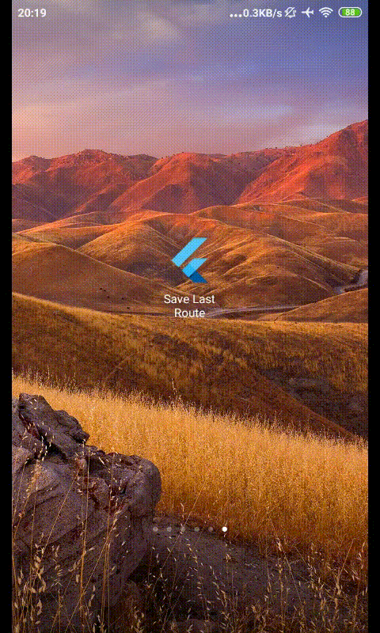

# Save Last Route

A Flutter app that demonstrates saving last screen and re-navigate to it at 
next app start. 

For demo, you may look here. [Example Screen Flow](#demo)

## A. Navigation

when we are navigating through different screens within app, actually, the route stacks are changing.

So, firstly, we need to figure out how to listen to this changes e.g Push screen, Pop back to users screen.


### 1. Attaching saving method in each action button 

we can actually put this on every navigation-related button.

**a. on drawer items**
``` dart
  ListTile(
    title: Text("Beta"),
    onTap: () {
      saveLastScreen(); // saving to SharedPref here
      Navigator.of(context).pushNamed('/beta'); // then push
    },
  ),

```

**b. on Titlebar back buttons**
``` dart
	appBar: AppBar(
    title: Text("Screen"),
    leading: IconButton(
      icon: Icon(Icons.menu),
      onPressed: () {
        saveLastScreen(); // saving to SharedPref here
        Navigator.pop(context); // then pop
      },
    ),
  ),
```

**c. and also capturing event of Phone Back button on Android devices**
``` dart
  @override
  Widget build(BuildContext context) {
    return WillPopScope(
      onWillPop: (){ // will triggered as we click back button
        saveLastScreen(); // saving to SharedPref here
        return Future.value(true);
      },
      child: Scaffold(
        appBar: AppBar(
          title: Text("Base Screen"),
        ),
```

Therefore, we will have more code and it will be harder to manage.


### 2. Listening on Route Changes using `Route observer`

Nonetheless, Flutter provides on MaterialApp, that we can have some "`middleware`" 
to capture those changes on route stacks.

We may have this on our MyApp widget :

``` dart
class MyApp extends StatelessWidget {
  @override
  Widget build(BuildContext context) {
    return MaterialApp(
      title: 'Save Last Route',
      navigatorObservers: <NavigatorObserver>[
        MyRouteObserver(), // this will listen all changes
      ],
      routes: {
        '/': (context) {
          return BaseScreen();
        },
        '/alpha': (context) {
          return ScreenAlpha();
        },
```

We can define `MyRouteObserver` class as below :

``` dart
class MyRouteObserver extends RouteObserver {

  void saveLastRoute(Route lastRoute) async {
    final SharedPreferences prefs = await SharedPreferences.getInstance();
    prefs.setString('last_route', lastRoute.settings.name);
  }

  @override
  void didPop(Route route, Route previousRoute) {
    saveLastRoute(previousRoute); // note : take route name in stacks below
    super.didPop(route, previousRoute);
  }

  @override
  void didPush(Route route, Route previousRoute) {
    saveLastRoute(route); // note : take new route name that just pushed
    super.didPush(route, previousRoute);
  }

  @override
  void didRemove(Route route, Route previousRoute) {
    saveLastRoute(route);
    super.didRemove(route, previousRoute);
  }

  @override
  void didReplace({Route newRoute, Route oldRoute}) {
    saveLastRoute(newRoute);
    super.didReplace(newRoute: newRoute, oldRoute: oldRoute);
  }
}
```


## B. How to Start the App

As users interacting through the screens, the Shared Preferences will always store last route name. To make the app navigate correspondingly, we need to make our BaseScreen statefull and override its initState method as below :

``` dart
return MaterialApp(
  routes: {
    '/': (context) {
      return BaseScreen(); // define it as Main Route
    },
```

``` dart
class BaseScreen extends StatefulWidget {
  @override
  _BaseScreenState createState() => _BaseScreenState();
}

class _BaseScreenState extends State<BaseScreen> {
  @override
  void initState() {
    super.initState();
    navigateToLastPage();
  }

  void navigateToLastPage() async {
    final SharedPreferences prefs = await SharedPreferences.getInstance();
    String lastRoute = prefs.getString('last_route');
    // No need to push to another screen, if the last route was root
    if (lastRoute.isNotEmpty && lastRoute != '/') {
      Navigator.of(context).pushNamed(lastRoute);
    }
  }

```


## Demo


Saving and Opening Screen Beta and Screen Delta in different starts